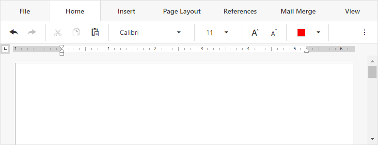

<!-- default badges list -->

[](https://supportcenter.devexpress.com/ticket/details/T917398)
[](https://docs.devexpress.com/GeneralInformation/403183)
[](#does-this-example-address-your-development-requirementsobjectives)
<!-- default badges end -->
# Rich Text Editor for ASP.NET Core - How to load/save documents from/to a database

This example demonstrates how to configure the [Rich Text Editor](https://docs.devexpress.com/AspNetCore/400373/rich-edit) control to load/save documents from/to a database.



## Overview

Follow the steps bellow to configure the Rich Text Editor to work with a database:

1. Create a class that models a document. This class should be able to store document identifiers, file formats, and content:

    ```cs
    public class DocumentInfo {
        [Key]
        public int ID { set; get; }
        [Column("documentName")]
        public string DocumentName { set; get; }
        [Column("documentBytes")]
        public byte[] DocumentBytes { set; get; }
        [Column("documentFormat")]
        public int DocumentFormat { set; get; }
    }
    ```

2. Register the database context and add a connection string.

3. In the `Index` action method, load a document from the database and save the document to a model:

    ```cs
    public IActionResult Index() {
        var model = _context.Docs.FirstOrDefault();
        if (model == null)
            model = new DocumentInfo();
        return View(model);
    }
    ```

4. Create the Rich Text Editor and call its [Open](https://docs.devexpress.com/AspNetCore/DevExpress.AspNetCore.RichEdit.RichEditBuilder.Open(System.Func-System.Byte----DevExpress.AspNetCore.RichEdit.DocumentFormat)?p=netframework) method to open the document stored in the model:

    ```cshtml
    @(Html.DevExpress().RichEdit("richEdit")
        .Width("100%")
        .Height(800)
        .ExportUrl(Url.Action("SaveDocument"))
        .Open(() => { return Model.DocumentBytes; }, (DevExpress.AspNetCore.RichEdit.DocumentFormat)Model.DocumentFormat)
    )
    ```

5. Implement an action method that saves the document opened in the Rich Text Editor control back to the database. Assign this action method to the control's [ExportUrl](https://docs.devexpress.com/AspNetCore/DevExpress.AspNetCore.RichEdit.RichEditBuilder.ExportUrl(System.String)?p=netframework) property:

    ```csharp
    public IActionResult SaveDocument(string base64, string fileName, int format, string reason) {
        byte[] fileContents = System.Convert.FromBase64String(base64);
        var doc = _context.Docs.FirstOrDefault();
        if (doc == null) {
            doc = new DocumentInfo();
            doc.DocumentBytes = fileContents;
            doc.DocumentFormat = format;
            doc.DocumentName = fileName;
            _context.Docs.Add(doc);
        } else {
            doc.DocumentBytes = fileContents;
            doc.DocumentFormat = format;
            doc.DocumentName = fileName;
            }
        _context.SaveChanges();
        return Ok();
    }
    ```

## Files to Review

* [Index.cshtml](./CS/Views/Home/Index.cshtml)
* [HomeController.cs](./CS/Controllers/HomeController.cs)
* [DocumentInfo.cs](./CS/Models/DocumentInfo.cs)
* [DocsDbContext.cs](./CS/Models/DocsDbContext.cs)
* [Startup.cs](./CS/Startup.cs)
* [appsettings.json](./CS/appsettings.json)

## Documentation

* [Document Management](https://docs.devexpress.com/AspNetCore/400972/rich-edit/document-management)
* [Examples](https://docs.devexpress.com/AspNetCore/401600/rich-edit/examples/how-to)

## More Examples

* [Rich Text Editor for ASP.NET Core - How to submit document content with other values](https://github.com/DevExpress-Examples/richedit-for-asp-net-core-how-to-submit-document-content-with-other-values)
<!-- feedback -->
## Does this example address your development requirements/objectives?

[](https://www.devexpress.com/support/examples/survey.xml?utm_source=github&utm_campaign=asp-net-core-richedit-work-with-database&~~~was_helpful=yes) [](https://www.devexpress.com/support/examples/survey.xml?utm_source=github&utm_campaign=asp-net-core-richedit-work-with-database&~~~was_helpful=no)

(you will be redirected to DevExpress.com to submit your response)
<!-- feedback end -->
